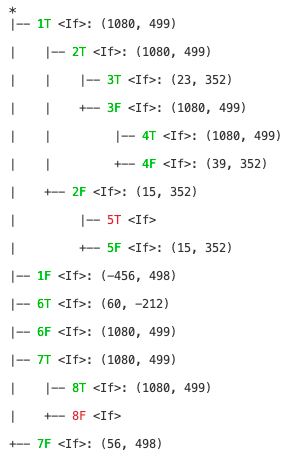
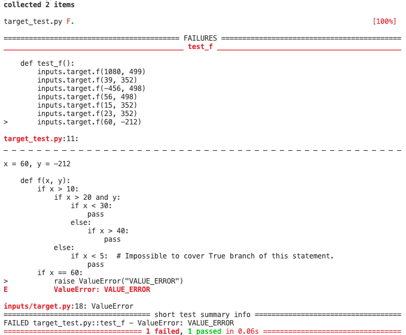

# Test Input Generation for Branch Coverage
Search-based test input generation for python source, aiming high branch coverage.
Coursework for CS453 Automated Software Testing, Spring 2020, KAIST

## About
This project is a search-based test input generator for python source. It aims for high branch coverage, and uses Alternating Variable Method (AVM) search.  
`inputs/sample*.py` files are provided from the [course by KAIST COINSE lab](https://coinse.kaist.ac.kr/teaching/2020/cs453/).

## Usage
Prerequisite: python3 (Tested with python 3.7.5)
```
$ pip install -r requirements.txt
$ python covgen.py {target_file.py}
```
More CLI argument options are provided. (`$ python covgen.py --help`)

## Requirements of target file
- This tool can generate input for function that is in the first layer of the module. Nested function or class methods are not supported.
- Target functions must take only integer arguments.
This tool targets branches of "If" statement and "While" statement.
- General boolop is supported for conditional statement. However, if the predicate is not single relational operator predicate, the fitness calculation of the optimization method it uses can have only 0 or 1 for branch distance.

## Features

### Listing of generated inputs.
This tool lists the generated inputs corresponding to each branch. If the branch is not covered, the tool prints `-` instead. Example is as below.
```
Function < k >

No branch detected for function 'k'.
============================================================
Function < f >

1T: 1080, 499
1F: -456, 498
2T: 1080, 499
2F: 15, 352
3T: 23, 352
3F: 1080, 499
4T: 1080, 499
4F: 39, 352
5T: -
5F: 15, 352
6T: 60, -212
6F: 1080, 499
7T: 1080, 499
7F: 56, 498
8T: 1080, 499
8F: -
```

### Pretty-print of branch graph and coverage.
If the branch is covered, it is printed in green with generated input. Otherwise, it is printed in red. Example is as below.

</br>

### Test file generation.
After running this tool on a target source `($FNAME).py`, a file name `($FNAME)_test.py` is generated. Example is as below, where the target source consists of 3 functions.
```
============================================================
Input generated for 3 functions.
Test file generated. Run '$ pytest target_test.py' to run the tests.
```
By running `$ pytest target_test.py`, error exception can be detected by testing. The generation doesn't put expected return value, but the user can easily add assertion in the generated file.

</br>


